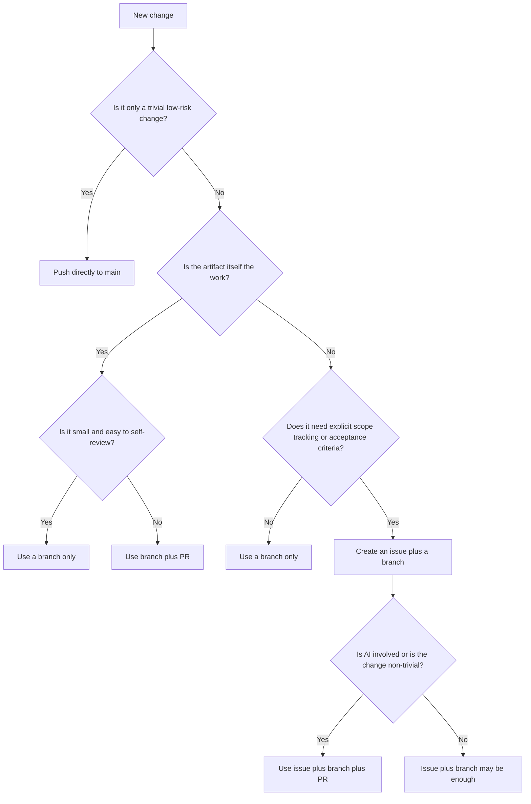

# Contributing to Arqix

This repository uses a lightweight solo-development workflow.

The goal is to keep the process:

- simple enough to use consistently,
- structured enough for AI-assisted work,
- and strict enough to protect `main`.

## Core Principles

- Keep `main` stable.
- Prefer small, reviewable changes.
- Use the lightest process that still preserves clarity.
- Use more structure when AI is involved.
- Do not create issues, branches, or PRs just for ritual.

## Quick Rules

### Directly Push to `main`

Allowed only for trivial, low-risk changes such as:

- typo fixes
- wording changes
- markdown formatting
- comments without behavior changes
- tiny metadata fixes

Do not push directly to `main` if the change affects:

- behavior
- code
- tests
- architecture
- CI/CD
- public interfaces
- generated project structure

### Use a Branch without Issue or PR

Use a branch for small changes that are still real work, for example:

- small internal refactorings
- minor documentation additions
- small test updates
- tiny CI or repo maintenance adjustments

Typical branch names:

- `docs/<slug>`
- `blog/<slug>`
- `report/<slug>`
- `fix/<slug>`
- `refactor/<slug>`

This is appropriate when:

- the scope is small,
- the intent is obvious,
- the change can be understood without a tracking artifact,
- and no formal review checkpoint is needed.

### Use Issue + Branch

Use an issue when the work benefits from explicit tracking, scope, or acceptance criteria.

Typical cases:

- a medium-sized change
- a feature or bugfix with non-trivial scope
- work derived from a handoff
- imports, normalization, or restructuring tasks
- anything that may spawn follow-up work

### Use Issue + Branch + PR

Use a PR whenever the change should be explicitly reviewed before merge.

This is the default for:

- all feature work
- all non-trivial bugfixes
- architecture changes
- public behavior changes
- changes derived from handoffs
- AI-assisted implementation
- AI-assisted review or restructuring
- anything with meaningful risk

## Special Guidance by Artifact Type

### Blog Posts, Reports, and Documentation Pieces

Usually:

- use a branch
- optionally use a PR if the change is large or AI-assisted

Examples:

- `blog/why-arqix-had-to-exist`
- `report/codex-vs-copilot-jumpstart`
- `docs/handoff-workflow`

An issue is usually not necessary, because the content artifact is the work item.

### Legacy Imports, Story Normalization, Structured Reviews

Usually:

- use an issue
- use a branch
- use a PR if AI is involved or if semantic restructuring happens

Examples:

- importing old user stories
- normalizing acceptance criteria
- unifying terminology
- restructuring requirements into a new template

## AI-specific Rules

If Codex or another coding agent is involved:

- do not work directly on `main`
- prefer an issue for non-trivial work
- use a PR for any meaningful implementation or restructuring
- keep the task scoped and explicit
- review the result before merge

For AI-assisted content work:

- a branch is usually enough for small drafting tasks
- use a PR if the generated output changes structure, meaning, or interpretation

## Decision Flow



## Practical Heuristics

- Use the smallest viable process
- Do not open an issue for a typo.
- Prefer a PR when meaning changes
- If the change affects semantics, behavior, structure, or interpretation, a PR is usually worth it.
- Prefer a PR when AI touches implementation
- AI can be fast and useful, but review remains mandatory.
- Use issues to preserve context

An issue is useful when future-you would otherwise ask:

“What exactly was the intended scope here?”

## Examples

### Example 1: Fix typo in README

- Direct push to main

### Example 2: Write a new blog article

- Branch: `blog/<slug>`
- PR optional

### Example 3: Add an experiment **report**

- Branch: `report/<slug>`
- PR optional
- PR recommended if AI drafted or restructured major sections

### Example 4: Import old user stories as-is

- Branch is often enough
- PR recommended if you want a review checkpoint

### Example 5: Normalize old user stories into a new format

- Issue
- Branch
- PR

### Example 6: Implement a feature from a handoff

- Issue
- Branch
- PR
- review before merge

## Branch Naming

Suggested prefixes:

- `blog/`
- `report/`
- `docs/`
- `feat/`
- `fix/`
- `refactor/`
- `chore/`

Keep names short, descriptive, and lowercase.

## Merging without a PR

For small solo changes, a branch can be merged without opening a pull request.

This is appropriate for:

- small documentation updates
- blog posts
- experiment reports
- minor internal cleanups
- low-risk changes that do not need a formal review checkpoint

Do not use this flow for:

- AI-assisted implementation with meaningful code changes
- architecture changes
- public behavior changes
- risky refactorings
- anything that should be explicitly reviewed before merge

### Recommended Fast-forward Merge Flow

Use this when the branch should merge cleanly into `main` without creating a merge commit.

```bash
git switch main
git pull
git merge --ff-only <branch>
git push
```

This keeps history linear and avoids unnecessary merge commits.

### If Fast-forward Merge Fails

This usually means that main has moved on and your branch is no longer directly ahead of it.

Rebase the branch onto main, then merge again:

```bash
git switch <branch>
git rebase main
git switch main
git merge --ff-only <branch>
git push
```

### Normal Merge Flow

If a fast-forward merge is not practical, a normal merge is acceptable for small solo work:

```bash
git switch main
git pull
git merge <branch>
git push
```

### Review before Merging

Even without a PR, quickly review the branch before merging:

```bash
git log --oneline main..<branch>
git diff main...<branch>
```

This helps verify:

- which commits are new
- what files changed
- whether anything unexpected is included

### Delete the Branch after Merge

Delete the local branch:

```bash
git branch -d <branch>
```

Delete the remote branch:

```bash
git push origin --delete <branch>
```

### Practical Default

For small solo content work, prefer this sequence:

```bash
git switch main
git pull
git merge --ff-only <branch>
git push
git branch -d <branch>
```

### Rule of Thumb

- Use `--ff-only` by default.
- Use a normal merge only when there is a good reason.
- Open a PR instead if the change is non-trivial, risky, or AI-assisted.

## Final Rule

When unsure, choose:

- branch instead of direct push
- PR instead of silent merge
- issue only if it preserves useful context
