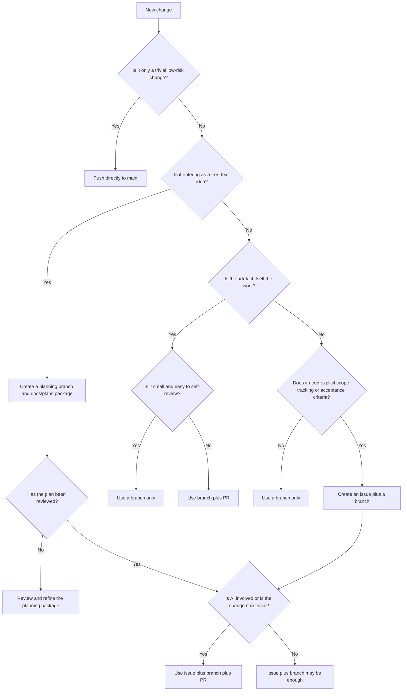

## Contributing to Arqix

This repository uses a lightweight solo-development workflow.

The goal is to keep the process:

- simple enough to use consistently,
- structured enough for AI-assisted work,
- and strict enough to protect `main`.

### Core Principles

- Keep `main` stable.
- Prefer small, reviewable changes.
- Use the lightest process that still preserves clarity.
- Use more structure when AI is involved.
- Do not create issues, branches, or PRs just for ritual.

### Workflow Layers

This repository uses four practical workflow levels.

#### 1. Direct Push to `main`

Allowed only for trivial, low-risk changes such as:

- typo fixes
- wording changes
- markdown formatting
- comments without behavior changes
- tiny metadata fixes

Do not push directly to `main` if the change affects:

- behavior
- code
- tests
- architecture
- CI/CD
- public interfaces
- repository structure in a meaningful way

#### 2. Branch Only

Use a branch without issue or PR for small but real changes where:

- the scope is small,
- the intent is obvious,
- the change can be understood without a tracking artefact,
- and no formal review checkpoint is needed.

Typical examples:

- small documentation additions
- blog posts
- experiment reports
- minor low-risk cleanup
- small test updates
- minor repository maintenance

#### 3. Issue plus Branch

Use an issue when the work benefits from explicit tracking, scope, or acceptance criteria.

Typical examples:

- a medium-sized change
- a feature or bugfix with non-trivial scope
- work derived from a handoff
- imports, normalization, or restructuring tasks
- work that may create follow-up tasks

#### 4. Issue plus Branch plus PR

Use a pull request whenever the change should be explicitly reviewed before merge.

This is the default for:

- all feature work
- all non-trivial bugfixes
- architecture changes
- public behavior changes
- changes derived from handoffs
- AI-assisted implementation
- AI-assisted review or restructuring
- anything with meaningful risk

### Content versus Implementation

Treat content artefacts differently from implementation work.

#### Content artefacts

Blog posts, reports, and standalone documentation pieces are often the work item itself.

Typical flow:

- use a branch
- optionally use a PR if the change is large or AI-assisted

Examples:

- `blog/why-arqix-had-to-exist`
- `report/codex-vs-copilot-jumpstart`
- `docs/handoff-workflow`

An issue is usually not necessary, because the content artefact is the work item.

#### Implementation Work

Features, bug fixes, refactorings, architecture changes, and structured requirements work usually need:

- explicit task context
- a dedicated branch
- a PR if AI is involved or the scope is non-trivial

### AI-specific Rules

If Codex or another coding agent is involved:

- do not work directly on `main`
- prefer an issue for non-trivial work
- use a PR for any meaningful implementation or restructuring
- keep the task scoped and explicit
- review the result before merge

For AI-assisted content work:

- a branch is usually enough for small drafting tasks
- use a PR if the generated output changes structure, meaning, or interpretation

### Planning Packages

For mobile-first work, prefer using a planning package under `docs/en/plans/<slug>/`.

The standard package contains:

- `IDEA.md`
- `PLANS.md`
- `STATUS.md`

Reviewed `PLANS.md` artefacts are the preferred bridge between free-text intake and later Codex implementation.

OpenClaw may create the initial planning branch and draft package from a free-text idea before the human refines it.

### Decision Flow



## Branch Naming

Use short, descriptive, lowercase branch names.

Suggested prefixes:

- `blog/`
- `report/`
- `docs/`
- `feat/`
- `fix/`
- `refactor/`
- `chore/`

Examples:

- `blog/why-arqix-had-to-exist`
- `report/openclaw-evaluation`
- `docs/contributing-workflow`
- `feat/handoff-parser`
- `fix/yaml-validation`
- `refactor/config-loading`

## Merging without a PR

For small solo changes, a branch can be merged without opening a pull request.

This is appropriate for:

- small documentation updates
- blog posts
- experiment reports
- minor internal cleanups
- low-risk changes that do not need a formal review checkpoint

Do not use this flow for:

- AI-assisted implementation with meaningful code changes
- architecture changes
- public behavior changes
- risky refactorings
- anything that should be explicitly reviewed before merge

### Recommended Fast-forward Merge Flow

Use this when the branch should merge cleanly into `main` without creating a merge commit.

```bash
git switch main
git pull
git merge --ff-only <branch>
git push
```

This keeps history linear and avoids unnecessary merge commits.

### If Fast-forward Merge Fails

This usually means that `main` has moved on and your branch is no longer directly ahead of it.

Rebase the branch onto `main`, then merge again:

```bash
git switch <branch>
git rebase main
git switch main
git merge --ff-only <branch>
git push
```

### Normal Merge Flow

If a fast-forward merge is not practical, a normal merge is acceptable for small solo work:

```bash
git switch main
git pull
git merge <branch>
git push
```

### Review before Merging

Even without a PR, quickly review the branch before merging:

```bash
git log --oneline main..<branch>
git diff main...<branch>
```

This helps verify:

- which commits are new
- what files changed
- whether anything unexpected is included

### Delete the Branch after Merge

Delete the local branch:

```bash
git branch -d <branch>
```

Delete the remote branch:

```bash
git push origin --delete <branch>
```

## Practical Heuristics

### Use the Smallest Viable Process

Do not open an issue for a typo.

### Prefer a PR when Meaning Changes

If the change affects semantics, behavior, structure, or interpretation, a PR is usually worth it.

### Prefer a PR when AI Touches Implementation

AI can be fast and useful, but review remains mandatory.

### Use Issues to Preserve Context

An issue is useful when future-you would otherwise ask:

"What exactly was the intended scope here?"

## Examples

### Example 1: Fix Typo in README

- Direct push to `main`

### Example 2: Write a New Blog Article

- Branch: `blog/<slug>`
- PR optional

### Example 3: Add an Experiment Report

- Branch: `report/<slug>`
- PR optional
- PR recommended if AI drafted or restructured major sections

### Example 4: Import Old User Stories As-is

- Branch is often enough
- PR recommended if you want a review checkpoint

### Example 5: Normalize Old User Stories into a New Format

- Issue
- Branch
- PR

### Example 6: Implement a Feature from a Handoff

- Issue
- Branch
- PR
- review before merge

## Final Rule

When unsure, choose:

- branch instead of direct push
- PR instead of silent merge
- issue only if it preserves useful context
