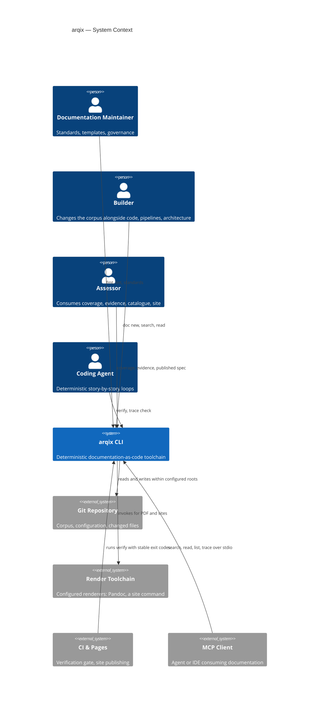

## Context and Scope

arqix operates on a documentation corpus inside a git repository.
Humans and coding agents drive it through the CLI; CI runs the same commands as a gate; MCP clients consume the corpus through the built-in server.
Rendering is delegated to external tools that arqix orchestrates but never trusts with control flow.

<!-- derived from ../model/workspace.dsl (view: SystemContext) -->

External interfaces: the filesystem (bounded by REQ-00-00-00-13), the render toolchain contract (errors forwarded transparently, REQ-04-01-03-07), the exit-code contract towards CI (REQ-04-01-08-01), and MCP over stdio (REQ-05-01-12-*).
