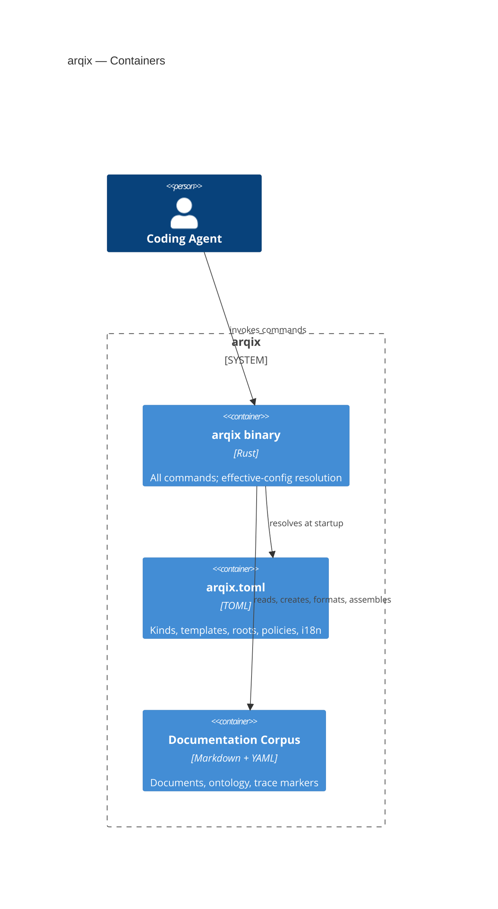

## Building Block View

<!-- derived from ../model/workspace.dsl (view: Containers) -->

The binary decomposes into fifteen components: the CLI entrypoint as composition root, the document parser as shared reading layer, the verification orchestrator sequencing the quality gate, and twelve feature components cut along the requirement clusters:

| Component | Responsibility | Requirement cluster |
| --- | --- | --- |
| CLI Entrypoint & Dispatch | Argument parsing, subcommand routing, composition root (config → component → diagnostics/exit code) | REQ-00-00-00-02/03/06 |
| Document Parser | Single deterministic parse of YAML frontmatter into the semantic model (id, iri, title, classes, triples, language); retains raw frontmatter lines and body for the rewriter | REQ-05-01-10-*, REQ-01-01-03-03 |
| Verification Orchestrator | Sequences the configured verify sub-steps (format, lint, trace scan, coverage) via the stable command interface; fail-fast/aggregate modes, per-step JSON results; never implements a check itself ([ADR-0003](../../adr/ADR-0003-verification-orchestrator.md)) | REQ-04-01-05-* |
| Config Resolver | Effective configuration from defaults + overrides, validation | REQ-01-01-16-*, REQ-00-00-00-06 |
| Document Store & Catalog | Discovery over the roots, JSON catalog reading declared IDs, backing doc list/read/search | REQ-05-01-08-*, REQ-05-01-10-*, REQ-02-01-06-01 |
| Template Engine | Kind-based creation, placeholder substitution | REQ-00-00-00-05, REQ-01-01-05-* |
| Formatter & Finaliser | Canonical rewrites over the parser CST: `fmt` (key order, directives) and `finalise` (mechanical metadata updates, injected clock); the only mutator of existing source documents ([ADR-0004](../../adr/ADR-0004-finalise-and-the-mechanical-rewriter.md)) | REQ-01-01-03-*, REQ-01-01-06-*, REQ-00-00-00-08 |
| Linter | Includes, references, ID policy, lifecycle, done claim, translation source, architecture-view derivation | REQ-01-01-04-*, REQ-01-01-18-*, REQ-03-01-09-*, REQ-00-00-00-10, REQ-04-01-18-* |
| Assembler | Chapter/include directives, glob expansion, cycle detection, JSONL log | REQ-02-01-09-*, REQ-02-01-11-*, REQ-04-01-01-* |
| Trace Engine | Marker scan, trace graph, matrices, coverage, marker freshness against git history | REQ-03-01-05-*, REQ-03-01-02-*, REQ-01-01-08-*, REQ-03-01-11-* |
| Report & Export | Audit exports, evidence bundles, stable schemas | REQ-04-01-12-*, REQ-03-01-04-* |
| Publish & Render Orchestrator | Pandoc/site orchestration per language | REQ-04-01-03-*, REQ-04-01-07-* |
| Policy Checker | Changed files vs declared change scope | REQ-01-01-07-*, REQ-00-00-00-07 |
| MCP Server | search/read/list over stdio, transport-separated | REQ-05-01-12-* |
| Diagnostics & Exit Codes | Machine-readable diagnostics, 0/1/2 contract | REQ-00-00-00-02/03, REQ-04-01-08-*, REQ-04-01-10-* |

Shared spine: the CLI Entrypoint invokes every feature component and is the only place that turns results into exit codes; every component reports through Diagnostics & Exit Codes, reads configuration through the Config Resolver, and reads documents through the Document Parser; the Verification Orchestrator sequences the quality-gate sub-steps through the same command interface the entrypoint uses (ADR-0003).
These five are the components that make the cross-cutting contracts (chapter 8) enforceable in one place; beyond the shared reading path through the Document Store & Catalog (Template Engine, Linter, Assembler, and MCP Server all discover the corpus through it — the Trace Engine walks the filesystem itself, mirroring the Python oracle), lateral coupling between feature components is limited to the export and publish paths: the Publisher's edges (→ Assembler for staging, → Store and Trace Engine for the specification catalogue), the Reporter's edges (→ Trace Engine for evidence, → Store and Assembler for the knowledge bundle), the MCP Server's trace tool (→ Trace Engine), and the Assembler's reuse of the Linter's include-directive grammar — the orchestrators' edges are command-API orchestration, not implementation coupling.
A complementary write-path invariant holds across the cut: existing source documents are mutated only by the Formatter & Finaliser; the Template Engine creates new files, and Assembler and Publisher write generated artefacts (ADR-0004).

### Command ownership

Each command has exactly one owning component — the component whose tests own the command's behaviour.
The spine (Entrypoint → Config Resolver → … → Diagnostics & Exit Codes) is implicit in every flow; write flows additionally pass the containment, overwrite, and dry-run guards.

| Command | Owning component | Flow between entrypoint and diagnostics | Requirement anchor |
| --- | --- | --- | --- |
| `config validate`, `config show` | Config Resolver | resolver only | REQ-01-01-16-* |
| `doc init` | Template Engine | writes the package scaffold; IDs/slugs via Document Store | REQ-01-01-01-* |
| `doc new <kind>`, `unit new` | Template Engine | → Store (ID/slug/target path) → guarded write | REQ-00-00-00-05, REQ-01-01-13-* |
| `doc list` | Document Store & Catalog | → Parser (bulk) → JSON catalog | REQ-05-01-08-* |
| `doc read` | Document Store & Catalog | → Parser (sections/anchors) | REQ-05-01-10-* |
| `doc search` | Document Store & Catalog | → Parser; index question open (chapter 11) | REQ-02-01-06-01 |
| `fmt` | Formatter & Finaliser | → Parser CST → canonical rewrite | REQ-01-01-03-* |
| `finalise` | Formatter & Finaliser | → Parser CST → targeted value edit; injected clock | REQ-01-01-06-* |
| `lint run` (incl. translation-source and architecture-view derivation checks) | Linter | → Parser/Store (+ C4 model) → findings | REQ-01-01-04-*, REQ-01-01-18-*, REQ-00-00-00-10, REQ-04-01-18-* |
| `assemble build` | Assembler | → Parser (directives) → Store (targets) → `pages/` + JSONL log | REQ-02-01-11-*, REQ-04-01-01-* |
| `trace scan`, `trace check` | Trace Engine | → Parser (markers, links) + code/test files → graph | REQ-03-01-05-*, REQ-03-01-06-* |
| `trace coverage`, `trace matrix` | Trace Engine | graph projections; serialisation via Report & Export | REQ-01-01-08-*, REQ-03-01-02-* |
| `trace ratchet` | Trace Engine | baseline (`--baseline` / configured / committed snapshot) → fail on verified-coverage regression | REQ-04-01-15-*, REQ-04-01-16-* |
| `trace freshness` | Trace Engine | active markers → git last-change of marker vs target requirement → possibly-stale findings (ADR-0015) | REQ-03-01-11-* |
| `report bundle` (evidence bundles) | Report & Export | → Trace Engine (graph) → stable schemas | REQ-03-01-04-*, REQ-04-01-12-* |
| `report knowledge` (OKF export) | Report & Export | → Store (scope, lifecycle) → Assembler (expansion) → concept documents | REQ-05-01-15-* |
| `publish site --lang`, `render pdf` | Publish & Render Orchestrator | → Assembler → external toolchain (errors forwarded) | REQ-04-01-03-*, REQ-04-01-07-* |
| `policy check` | Policy Checker | changed-file list (external) → policy from config | REQ-01-01-07-* |
| `verify` | Verification Orchestrator | → fmt/lint/scan/coverage/ratchet/freshness via the command interface ([ADR-0003](../../adr/ADR-0003-verification-orchestrator.md)) | REQ-04-01-05-* |
| `mcp serve` | MCP Server | transport adapter over Store operations | REQ-05-01-12-* |

This table is the seed for the component test contracts: every row becomes the owning component's command-level test suite, and every flow becomes an integration-test skeleton.

The command taxonomy behind this table — noun–verb scheme, every analysis exists exactly once (coverage is `trace coverage`), `report` reserved for export products, `verify` as the deliberate top-level exception — is fixed in [ADR-0005](../../adr/ADR-0005-command-taxonomy.md); this table is the normative command map.
