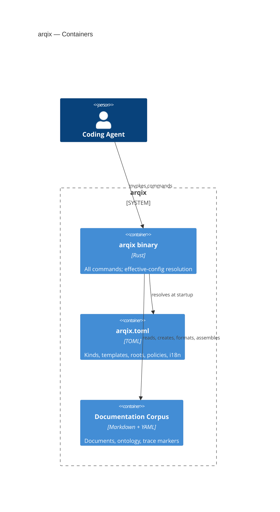

## Building Block View

<!-- derived from ../model/workspace.dsl (view: Containers) -->

The binary decomposes into twelve components, cut along the requirement clusters:

| Component | Responsibility | Requirement cluster |
| --- | --- | --- |
| Config Resolver | Effective configuration from defaults + overrides, validation | REQ-01-01-16-*, REQ-00-00-00-06 |
| Document Store & Catalog | Discovery, ID/slug policy, JSON catalog | REQ-00-00-00-04, REQ-05-01-08-* |
| Template Engine | Kind-based creation, placeholder substitution | REQ-00-00-00-05, REQ-01-01-05-* |
| Formatter | Canonical key order, directive normalisation | REQ-01-01-03-* |
| Linter | Includes, metadata contracts, IDs, i18n profile | REQ-01-01-04-*, REQ-01-01-10-*, REQ-00-00-00-10 |
| Assembler | Chapter/include directives, glob expansion, cycle detection, JSONL log | REQ-02-01-09-*, REQ-02-01-11-*, REQ-04-01-01-* |
| Trace Engine | Marker scan, trace graph, matrices, coverage | REQ-03-01-05-*, REQ-03-01-02-*, REQ-01-01-08-* |
| Report & Export | Audit exports, evidence bundles, stable schemas | REQ-04-01-12-*, REQ-03-01-04-* |
| Publish & Render Orchestrator | Pandoc/site orchestration per language | REQ-04-01-03-*, REQ-04-01-07-* |
| Policy Checker | Changed files vs declared change scope | REQ-01-01-07-*, REQ-00-00-00-07 |
| MCP Server | search/read/list over stdio, transport-separated | REQ-05-01-12-* |
| Diagnostics & Exit Codes | Machine-readable diagnostics, 0/1/2 contract | REQ-00-00-00-02/03, REQ-04-01-08-*, REQ-04-01-10-* |

Shared spine: every component reports through Diagnostics & Exit Codes and reads through the Config Resolver — the two components that make the cross-cutting contracts (chapter 8) enforceable in one place.
