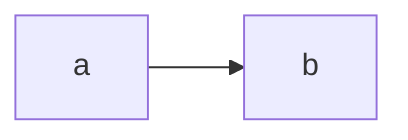

# Embedding Diagrams

This guide explains how diagrams enter arqix documents and how they reach the published output.

arqix orchestrates external renderers — Kroki for diagram languages, Pandoc for PDF, a configured site command for the web — but it never renders content itself (REQ-00-00-00-14, no content execution).
So embedding a diagram is plain Markdown plus render-toolchain configuration; the `include` directive needs nothing special, and it is only ever used for Markdown fragments.

There are two patterns.
Pick by asking one question: is there a separate source of truth the diagram is derived from, or is the diagram's own source the truth?

## Rendered image (committed)

Use this when the diagram is derived from a separate source of truth — the C4 views, for example, are derived from `docs/en/architecture/model/workspace.dsl`.

Render the source to an image, commit the image, and embed it with ordinary Markdown:

```markdown

```

The mechanics:

- A containerised renderer turns the source into SVG under a generated directory (for the C4 views, `docs/en/architecture/model/generated/`, produced by `just render-views`, ADR-0016).
- The images ride into the site staging through `[policies.publish] assets` — the toolchain can only reference what reaches staging.
- A regenerate-and-diff freshness gate keeps the committed image honest against the model, the same pattern the report snapshots use.

The image is a static asset, so it is visible everywhere — in raw Markdown on GitHub, on the site, and in the PDF — without a renderer at view time.

## Inline fence (rendered on build)

Use this when the fence itself is the source of truth — a one-off flowchart tied to the prose, a Vega chart, a sequence diagram.

Write the source in a fenced block:

````markdown

````

arqix passes the fence through verbatim; a downstream renderer turns it into an image at build time:

- for the PDF, a Pandoc filter (a Kroki or Mermaid filter) named in the Pandoc defaults file that `[policies.render] defaults` passes through;
- for the site, a build plugin.

The fence is always in sync because it is rendered on every build, but it needs the renderer present at build time, and only Mermaid fences render natively on GitHub — Vega, PlantUML, and the rest need the toolchain.

## Choosing

| | Rendered image (committed) | Inline fence (on build) |
| --- | --- | --- |
| Source of truth | a separate model (e.g. `workspace.dsl`) | the fence itself |
| Freshness | drift is possible, so a gate re-renders and diffs | always fresh, rendered each build |
| Visible without a renderer | yes, everywhere | Mermaid on GitHub only |
| Fits | derived diagrams | ad-hoc diagrams next to the prose |

## What arqix owns, and what it does not

arqix orchestrates the render containers, carries image assets into staging (`[policies.publish] assets`), and configures the Pandoc filter (`[policies.render] defaults`) — all configuration, no rendering of its own.

`include` expands Markdown fragments and composes with either pattern; it does not wrap a raw diagram source file (`.puml`, `.mmd`, `.vl.json`) in a fence.
To keep a diagram source in its own file today, either put the fence inside a Markdown fragment and include that, or reference the rendered image; an include that wraps a raw source in a fence would be convenience sugar, not a gap.
